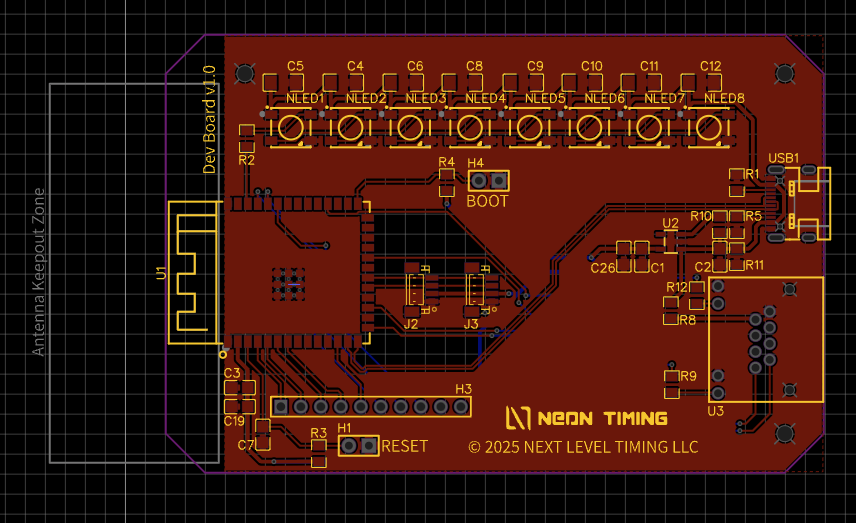

# Neon Timing Pixel

> [!WARNING]
> The [Neon Timing protocol](https://github.com/NextLevelTiming/neon-timing-protocol) is currently under development.
> It is not advised to produce production hardware at this time

---

The Pixel is a prototyping device for
the [Neon Timing protocol](https://github.com/NextLevelTiming/neon-timing-protocol). It can be programmed to control the
LEDs to signal race events, adapted for other purposes, or used as a reference for other devices. The PCB
contains a microcontroller, a strip of NeoPixel LEDs, and several ports used for development.

The Pixel is powered by a 5v USB power supply and is controlled by a USB connection to a computer over serial using
the [Neon Timing protocol](https://github.com/NextLevelTiming/neon-timing-protocol).

The device ports include:

- USB-C port for connecting to a computer
- (2) JST SH ports for I2C
    - Please check wiring for compatibility with Stemma QT or Qwiic devices
- RJ45 port - for accessory devices.
    - **Not for ethernet**
    - This is a custom pinout
    - This has no current functionality
- 1x10 header for various signals
    - Review the schematic for details.

## PCB Layout

## PCB Files

- [Schematic](./pcb/schematic.png)
- [Gerber](./pcb/gerber.zip)

## Programming the ESP32

The Pixel contains an ESP32-S3 which can be programmed using [PlatformIO](https://platformio.org/).

You can modify the [neon-timing-serial-example](https://github.com/NextLevelTiming/neon-timing-serial-example) project
to work for Pixel.

You can write your own code using the [Neon Timing CPP](https://github.com/NextLevelTiming/neon-timing-cpp) library or
by directly implementing the [Neon Timing Protocol](https://github.com/NextLevelTiming/neon-timing-protocol).

## Flashing the ESP32

1. Connect the Pixel to a computer using a USB-C cable
1. Connect/bridge the `RESET` and `BOOT` pins using a jumper or a wire
    1. You are not connecting `RESET` to `BOOT`, you are connecting the two pins labeled `RESET` and `BOOT` together
1. Release the `RESET` pins while continuing to keep the connection on the `BOOT` pin
1. Release the `BOOT` pin
1. After a few seconds, the ESP32 can be flashed from software like PlatformIO or Arduino

## Testing

Neon Timing serial devices can be tested using
the [Neon Timing Toolkit](https://nextleveltiming.github.io/neon-timing-web-usb/)
from browsers that supports usb devices.

## 3D Printed Enclosure

3D printed enclosure was designed to help create a diffusion of the light produced by the LEDs on the PCB.
The enclosure has two parts that snap together. Choose a diffuser based on the translucency of the material you are
using to print the enclosure.

- [Base](./stls/base.stl)
    - Designed to hold the PCB and make the USB-C and RJ45 ports accessible
- [Large Diffuser](./stls/large-diffuser.stl)
    - Designed to diffuse the light from the LEDs
    - Should be printed in a translucent material
- [Large Thin Diffuser](./stls/large-thin-diffuser.stl)
    - Designed to diffuse the light from the LEDs
    - Thinner than the large diffuser for less transparent materials
    - Should be printed in a translucent material, such as white or clear

## Licenses

The Pixel [STL](./stls) and [PCB](./pcb) files are © 2025 Next Level Timing LLC is licensed under the Creative Commons
Attribution-NonCommercial-ShareAlike 4.0 International License.

The Pixel [src](./src) files are © 2025 Next Level Timing LLC is licensed under the MIT License.
